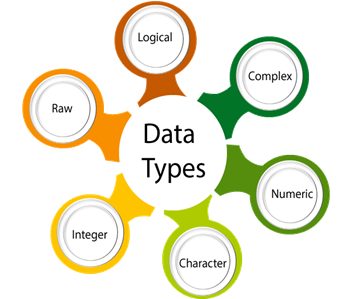
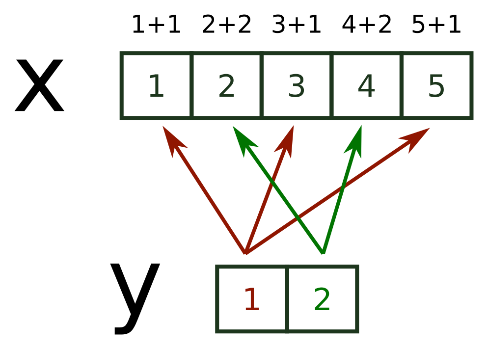
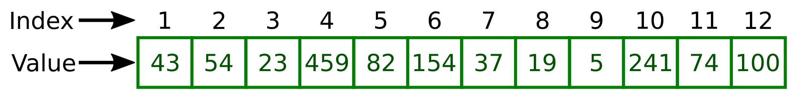

<!-- GENERATED by _MakeInstructorNotes.R from _instructor_prompt.md.
     Committed, but do not hand-edit below the BODY marker: the next run
     that sees a changed source page overwrites it. To change the prose,
     edit the prompt; to change the layout, edit this script. -->
<!-- instructor-notes: source=session1.qmd md5=7b0eef2bdecbba866513c880ff193f6b commit=25471859b6eac7133160cbe89f84a78b0ffdef91 dirty=no model=opus effort=high -->

```{r}
#| label: instructor-setup
#| include: false
# width/cli.width are set project-wide in _quarto.yml and are restated
# here so that this one chunk is the whole story for a generated page -
# otherwise a later edit here silently drops them.
options(width = 80, cli.width = 80,
        tibble.print_min = 2, tibble.print_max = 2,
        # A 32-column tibble spends six lines listing the columns it
        # could not fit. One line saying how many is enough here - the
        # "1,904 x 32" header already gives the shape.
        tibble.max_extra_cols = 1)

# Base data frames have no equivalent of the tibble options, so they need
# a method. It MUST let tibbles through: they are data frames too, so S3
# dispatch would land them here, and head() would throw away the real
# row count that the tibble footer reports. kable/kableExtra/DT all
# return their own classes, so none of them come through this.
registerS3method("knit_print", "data.frame", function(x, ...) {
    if (inherits(x, "tbl_df")) return(knitr::normal_print(x))
    knitr::normal_print(utils::head(x, 2L))
}, envir = asNamespace("knitr"))
```

::: {.instructor-nav}
[Contents](instructor_index.html) &nbsp;·&nbsp; **1** &nbsp;·&nbsp; [2](instructor_session2.html) &nbsp;·&nbsp; [3](instructor_session3.html) &nbsp;·&nbsp; [4](instructor_session4.html) &nbsp;·&nbsp; [5](instructor_session5.html) &nbsp;·&nbsp; [6](instructor_session6.html) &nbsp;·&nbsp; [7](instructor_session7.html) &nbsp;·&nbsp; [8](instructor_session8.html) &nbsp;·&nbsp; [Student page](session1.html)
:::

<!-- BODY -->
::: {.callout-note .objectives title="Learning objectives"}
* Become familiar with using Positron for writing and running R scripts 
* Understand the basics of the different data types and data structures used in R
* Learn how to use simple functions
* Understand the concept of missing data and how it is handled in R
:::

# Introduction to R and Positron

# Why learn R?

* Scripts = a written, inspectable record -- **reproducibility**, increasingly expected by journals/funders
* Thousands of packages; scales from small tables to large data; connects to spreadsheets, databases, the web
* Publication-quality graphics; documents built from code (this page is Quarto)
* Free, open-source, cross-platform, large helpful community

# Positron - a brief tour

* IDE built on VS Code -- **Panel** (console) bottom, **Editor** above, **Activity Bar** left
* Only the Explorer icon matters for this course

## Console

* The actual interface to R -- type, press `Enter`

```
> 23 + 45
[1] 68
```

* What is the `[1]`? -- index of the first value **on that line**, not part of the answer

```
> 1:36
 [1]  1  2  3  4  5  6  7  8  9 10 11 12 13 14 15 16 17 18 19 20 21 22 23 24 25
[26] 26 27 28 29 30 31 32 33 34 35 36
```

* Wrapping depends on pane width/font -- theirs may differ; use `1:100` if it all fits on one line

```
> 1:36 * 2
 [1]  2  4  6  8 10 12 14 16 18 20 22 24 26 28 30 32 34 36 38 40 42 44 46 48 50
[26] 52 54 56 58 60 62 64 66 68 70 72
```

## The Explorer

* First thing always: open the working folder -- `Bioinformatics_Workshop` (contains `data`)
* "Open Folder" button or `File` >> `Open Folder`; expand the triangle to show `data`
* Positron reopens the last folder next time

## The Editor

* New file: "New File" on Welcome tab or `File` >> `New File`
* Type `My_First_Rscript.R` in the file-type box, save into `Bioinformatics_Workshop`
* Send code to console: `Ctrl + Enter` (`Cmd + Enter` Mac); highlight for multiple lines
* Why bother -- commands are saved, reusable, editable
* One script = one role in the workflow

## Session Panel

* `View` menu >> `Variables` -- shows objects and their values as they are created
* Plots panel below it; Help tab is the other one we use

# Our first look at the R language

* Data comes in many forms -- R needs a way to represent each

## Data types in R

::: {.showimg}


Show **the R data types diagram** here
:::

R has 6 basic data types:

* __character__
    * series of letters, numbers, punctuation -- often called a *string*
    * anything between quotes, single or double: "a", 'cat'
    * quoted numbers are character: '3.14'
* __double__: real numbers, whole or decimal: 10, 3.14, 1.45765, 5, 1000000
* __integer__: whole numbers -- 5L (the "L" forces integer storage)
* __logical__: TRUE, FALSE
* __complex__: 1+4i -- rare
* __raw__: raw bytes -- rare

* __double__ and __integer__ are both __numeric__
* __factor__ comes next session; dates etc. not covered

* Why types matter -- some operations only work on some types

```{r}
#| label: data_types_addition_error
#| eval: false
11 + 3 # Operation of addition performed correctly
"11" + 3 # gives error
```

* Also storage efficiency -- __integer__ uses less memory than __double__

## Data structures in R

::: {.showimg}


Show **the R data structures diagram** here
:::

* Atomic vector  
* data frame  
* matrix  
* list  
* factors  

### Atomic vector

* The fundamental structure -- everything else is built on vectors

```{r}
#| label: assignment_arrow
x <- 100
```

* `<-` is the **assignment operator** -- creates object `x` holding 100
* `object` and `variable` used interchangeably here
* `=` also works, but `<-` is best practice

```{r}
#| label: assignment_operators
x <- 100
x = 100
```

* Once created, reuse as often as needed

```{r}
#| label: variables_in_arithmetic
y <- 10
y * y
y + y
100 + y
```

* Values can be overwritten -- no warning

```{r}
#| label: reassign_variable
x <- "Tom"
x
x <- "Jerry"
x
```

* Now the rules for **legal names** -- cannot start with a number or special character

```{r}
#| label: invalid_name_leading_number
#| error: true
2x <- 100
```

```{r}
#| label: invalid_name_leading_underscore
#| error: true
_x <- 100
```

* Only "\_" and "." allowed inside a name

```{r}
#| label: invalid_name_hyphen
#| error: true
my-name <- "Ashley"
```

* Say why: R reads `my - name` as subtraction of two non-existent objects

```{r}
#| label: valid_names
my_name <- "Ashley"
my.name <- "Ashley"
```

* R is case sensitive 
* COUNTRY and country are two different variables

```{r}
#| label: names_are_case_sensitive
COUNTRY <- "United Kingdom"
country <- "Uganda"

COUNTRY
country
```

#### Atomic vectors with more than one value

* The `c()` function should be used to create a vector that holds more than one value
* c stands for combine
* values are separated by ","

```{r}
#| label: multiple_values_error
#| error: true
x <- 100, 200
```

```{r}
#| label: vector_from_c
x <- c(100, 200)
```

* the ":" operator that generates a range of values

```{r}
#| label: vector_from_colon
x <- 1:40
x
```

* All values in a vector must be **the same type**
* Mix them and R silently converts -- **coercion**

```{r}
#| label: vector_types_and_coercion
x <- c(1, 2, 3, 4)
typeof(x)
x <- c(1, "2", 3, 4)
typeof(x)

z <- c(TRUE, FALSE, FALSE)
typeof(z)

z <- c(TRUE, FALSE, "FALSE")
z
typeof(z)

y <- c(TRUE, FALSE, TRUE, 1L)
y
typeof(y)
```

#### A note on logical vectors

* TRUE/FALSE stored internally as 1/0 -- so maths works
* `sum()` counts the TRUEs, `mean()` gives the proportion

```{r}
#| label: logical_vector_arithmetic
y <- c(TRUE, FALSE, TRUE)
y
sum(y)
mean(y)
```

### Vectorization in R

* Most R functions are **vectorised** -- operate on every element at once, no loop
* Concise, fast, fewer errors

```{r}
#| label: vectorised_arithmetic
x <- c(1, 2, 3, 4, 5)
x * 5
x + 1
```

* Confusion arises when lengths differ -- equal lengths first

```{r}
#| label: vectorised_two_vectors
x <- c(1, 2, 3, 4, 5, 6)
y <- c(1, 2, 3, 4, 5, 6)
x + y
```

* Unequal lengths -- shorter vector is **recycled**

```{r}
#| label: vector_recycling
x <- c(1, 2, 3, 4, 5)
y <- c(1, 2)
x + y
```

::: {.showimg}


Show **the vector recycling diagram** here
:::
  
### Accessing specific elements of an atomic vector  

* `[]` is the **subscript operator**

Within `[]` one can give any of the following:    

* Vector of index numbers   
* Vector of logical values

::: {.showimg}


Show **the vector subsetting diagram** here
:::

#### Using integer vector containing index numbers

* R indexes from **1**, not 0

```{r}
#| label: create_vec
vec <- c(10, 20, 30, 40, 50, 60, 70, 80, 90, 100)
vec
```

```{r}
#| label: subset_single_element
vec[4]
```

```{r}
#| label: subset_multiple_elements
vec[c(4, 7)]
```

* "-" **inverts** the selection -- everything except those positions

```{r}
#| label: subset_negative_index
vec[c(-4, -7)]
```

* Same notation on the left of `<-` **replaces** values in place

```{r}
#| label: replace_element
x <- c(10, 20, 30)
x[2]
x[2] <- 1000
x
```

#### Using a logical vector to select values from a vector

* Logical vector should match the length of the target -- if shorter it is **recycled** (confusing; `vec[myLogicalVec]` shows this)

```{r}
#| label: subset_with_logical_vector
y <- c(5, 8, 10)
myLogicalVec <- c(FALSE, TRUE, FALSE)
y[myLogicalVec]
vec[myLogicalVec]
```

* In practice logical vectors come from **comparisons**, not typed by hand

```{r}
#| label: comparison_operators_table
#| echo: false
tab <- data.frame(Operator = c("==",   "!=", ">", "<", ">=", "<="),
                  Meaning = c("Equal to", "Not equal to", "Greater than",
                              "Less than", "Greater than or equal to",
                              "Less than or equal to"),
                  Example = c("100 == 90", "100 != 90", "100 > 90", "100 < 90", "100 >= 90", "90 <= 90"),
                  Result = c("FALSE", "TRUE", "TRUE", "FALSE", "TRUE", "TRUE"))
knitr::kable(tab)
```

* Comparison is vectorised -- tests every element, returns a logical vector
* Show both forms: named `keep` object, then the test inline

```{r}
#| label: subset_with_comparison
x <- c(10, 20, 30, 40)
x == 20
x > 20

keep <- x > 20
keep
x[keep]
x[ x > 20 ]
```

* Combine tests with the logical operators

```{r}
#| label: logical_operators_table
#| echo: false
tab <- data.frame(Operator = c("&", "|", "!"),
           Meaning = c("AND", "OR", "NOT"), 
           Effect  = c("Connects two expressions into one. Both expressions must be true for the overall expression to be true",
                       "Connects two expressions into one. One or both of the expressions must be true for the overall expression to be true. It is only necessary for one to be true, it doesn't matter which",
                       "Inverts the \"truth\" of the expression - FALSE becomes TRUE and TRUE becomes FALSE"))
knitr::kable(tab)
```

* Greater than 10 AND less than 40 -- build it up from the two separate tests

```{r}
#| label: subset_with_and
x <- c(10, 20, 30, 40)
x[x > 10]
x[x < 40]
x[ x > 10 & x < 40]
```

* `!=` would do, but this demonstrates `!` (NOT) inverting a logical vector

```{r}
#| label: subset_with_not
x[ !x == 20 ]
```

### Converting the class of vector from one data type to another

The "as" family of functions:

* `as.character()`: convert to character type data
* `as.numeric()`: convert to numerics vector
* `as.integer()`: convert to integer vector
* `as.logical()`: convert to logical vector

* Effect depends on the original class -- some conversions are sensible, some are not

```{r}
#| label: convert_integer_to_character
x <- 1:5
x
as.character(x)
```

* Character to integer -- no sensible answer, so `NA` **with a warning**

```{r}
#| label: convert_character_to_integer
x <- c("apple", "banana", "orange")
x
as.integer(x)
```

* Unless the text looks like a number -- those convert, the rest become `NA`

```{r}
#| label: convert_mixed_character_to_integer
x <- c("Blue", "23", "45", "9.89", "Red")
x
as.integer(x)
```

* Point out `as.integer` truncated "9.89" to 9 -- `as.numeric` keeps the decimal

```{r}
#| label: convert_character_to_numeric
as.numeric(x)
```

```{r}
#| label: convert_logical
x <- c(TRUE, FALSE, TRUE, FALSE)
x
as.character(x)
as.integer(x)
```

### Testing the class of an object

The "is.XXX" family -- returns TRUE or FALSE:

* is.character(): to test if the object holds character type data  
* is.double(): to test if the object holds decimal type data  
* is.numeric(): to test if the object holds numeric type data  
* is.integer(): to test if the object holds integer type data  
* is.logical(): to test if the object holds logical type data  

Also for data structures:

* is.vector(): To determine if the object is a vector  
* is.matrix(): To determine if the object is a matrix  
* is.data.frame(): To determine if the object is a data frame  

```{r}
#| label: test_object_class
x <- 1:100
typeof(x)
is.integer(x)
is.vector(x)
is.matrix(x)
```

## R Arithmetic Operators

  * Addition: +
  * Subtraction: -
  * Multiplication: *
  * Division: /
  * Integer division: %/%
  * Modulus (Remainder from division): %%
  * Exponent: ^

```{r}
#| label: arithmetic_operators
5 * 5

3 ^ 3

7 / 3

7 %/% 3

7 %% 3
```

## Functions and their arguments

* Functions are canned scripts, and they live in **packages** -- some loaded for you (`mean`, `c`), more by installing others
* **Arguments** in, usually one value out; running one is **calling** it

```{r}
#| label: round_default
round(pi)
```

* Syntax is always name followed by `()`
* Argument names and number vary -- read the help page

Ways to get help:

* How to get help in R details: https://www.r-project.org/help.html
* `?` followed by the function name, e.g. `?round`
* `help()`, e.g. help("round") -- note the quotes
* Web search, e.g. "R round documentation"

```{r}
#| label: round_help
#| eval: false
?round
```

`round()` takes two arguments:

* x: a numeric vector
* digits: integer indicating the number of decimal places to round

```{r}
#| label: round_named_arguments
round(x = pi, digits = 0)
round(x = pi, digits = 2)
round(x = pi, digits = 4)
```

* Named arguments -- order is irrelevant

```{r}
#| label: round_named_arguments_reordered
round(digits = 4, x = pi)
```

* Unnamed -- **positional**, order is everything

```{r}
#| label: round_positional_arguments
round(pi, 4)
```

* Best practice: name everything except the first argument

```{r}
#| label: round_mixed_arguments
round(pi, digits = 4)
```

* Naming avoids silent mistakes -- this runs, but rounds 4 to 3 decimal places

```{r}
#| label: round_arguments_wrong_order
round(4, pi)
```

Some useful math/stat functions in R:  

* `max()`: maximum value in a numeric vector
* `min()`: minimum value in a numeric vector
* `range()`: vector of min and max
* `sum()`: sum of a vector
* `mean()`: mean of a vector
* `median()`: median of a vector
* `var()`: variance of a vector
* `sd()`: standard deviation of a vector
* `sort()`: sorted version of a vector
* `length()`: length of an object
* `cor()`: correlation of x and y

Data type conversion functions:

* `as.numeric()`  
* `as.character()`  
* `as.integer()`  

## Missing data

* Missing data is built into R -- represented as `NA`
* `NA` **propagates**: most functions return `NA` if any input is missing -- deliberate, so you can't miss it
* `na.rm = TRUE` computes while ignoring missing values

```{r}
#| label: missing_values_na_rm
heights <- c(2, 4, 4, NA, 6)
mean(heights)
max(heights)
mean(heights, na.rm = TRUE)
max(heights, na.rm = TRUE)
```

* `is.na()` gives a logical vector -- combine with `!` to drop missing values, for functions with no `na.rm`

```{r}
#| label: remove_missing_values
missingValues <- is.na(heights)
missingValues
cleanedHeights <- heights[!missingValues]
cleanedHeights
```

#### Credit

These instructions were adapted from [Data Carpentry](https://datacarpentry.org)
course materials by various members of the Bioinformatics Core at CRUK CI.
