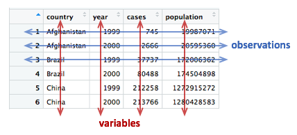
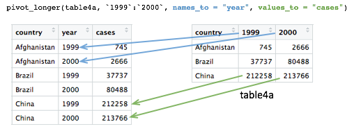

<!-- GENERATED by _MakeInstructorNotes.R from _instructor_prompt.md.
     Committed, but do not hand-edit below the BODY marker: the next run
     that sees a changed source page overwrites it. To change the prose,
     edit the prompt; to change the layout, edit this script. -->
<!-- instructor-notes: source=session7.qmd md5=b6f073535ce2acfd3087dc127fe1a1c8 commit=b706b28f289f4c3fcadee76dcecc404b92caf0a3 dirty=no model=opus effort=high -->

```{r}
#| label: instructor-setup
#| include: false
# width/cli.width are set project-wide in _quarto.yml and are restated
# here so that this one chunk is the whole story for a generated page -
# otherwise a later edit here silently drops them.
options(width = 80, cli.width = 80,
        tibble.print_min = 2, tibble.print_max = 2,
        # A 32-column tibble spends six lines listing the columns it
        # could not fit. One line saying how many is enough here - the
        # "1,904 x 32" header already gives the shape.
        tibble.max_extra_cols = 1)

# Base data frames have no equivalent of the tibble options, so they need
# a method. It MUST let tibbles through: they are data frames too, so S3
# dispatch would land them here, and head() would throw away the real
# row count that the tibble footer reports. kable/kableExtra/DT all
# return their own classes, so none of them come through this.
registerS3method("knit_print", "data.frame", function(x, ...) {
    if (inherits(x, "tbl_df")) return(knitr::normal_print(x))
    knitr::normal_print(utils::head(x, 2L))
}, envir = asNamespace("knitr"))
```

::: {.instructor-nav}
[Contents](instructor_index.html) &nbsp;·&nbsp; [1](instructor_session1.html) &nbsp;·&nbsp; [2](instructor_session2.html) &nbsp;·&nbsp; [3](instructor_session3.html) &nbsp;·&nbsp; [4](instructor_session4.html) &nbsp;·&nbsp; [5](instructor_session5.html) &nbsp;·&nbsp; [6](instructor_session6.html) &nbsp;·&nbsp; **7** &nbsp;·&nbsp; [8](instructor_session8.html) &nbsp;·&nbsp; [Student page](session7.html)
:::

<!-- BODY -->
::: {.callout-note .objectives title="Learning objectives"}
* Understand what makes a data set 'tidy' and why you'd want your data to be structured this way
* Use `pivot_longer()` and `pivot_wider()` operations to restructure data frames
* Tease apart columns containing multiple variables using `separate_wider_delim()`
* Modify character variables using string manipulation functions from the stringr package
* Customize non-data components of plots created using ggplot2 by changing the theme
:::

---

# Restructuring data

* Data as collected is rarely ready for analysis -- restructuring comes first
* ggplot2 and dplyr are built to work on **tidy** data -- hence 'tidyverse'
* Today's functions come from **tidyr** and **stringr** -- both loaded by `library(tidyverse)`

```{r}
#| label: library_tidyverse
library(tidyverse)
```

---

# Tidy data

* Same data (WHO TB report -- new TB cases + population, 3 countries, 1999/2000) shown 4 different ways
* Only one is tidy -- get the class to spot which

```{r}
#| label: tidy_table1
table1
```

```{r}
#| label: untidy_table2_table3
table2
table3
```

* `table4a`/`table4b` -- data split across two tables; realistic, population counted separately from cases

```{r}
#| label: untidy_table4
table4a
table4b
```

* Years-as-columns is extremely common in real time series data (ONS etc.)

## Rules for tidy data

::: {.rmdblock}
**Tidy data**

A tidy data set is a data frame (or table) for which the following are true:

1. Each **variable** has its own column
2. Each **observation** has its own row
3. Each **value** has its own cell

::: {.showimg}


Show **the tidy data diagram** here
:::

A **variable** contains all values that measure the same underlying attribute
(like height, temperature, duration) across units.

An **observation** contains all values measured on the same unit (like a person
or a day) across attributes.

_From ['Tidy Data'](https://www.jstatsoft.org/index.php/jss/article/view/v059i10/v59i10.pdf) by Hadley Wickham._
:::

**Question:** _Which of the above representations of TB cases is tidy?_

* Reframe as: what are the **variables**? -- country, year, cases, population
* `table4a`/`4b`: '1999' and '2000' are **values of a variable** (year), not variables -- not tidy
* Also can't compute a rate without joining two tables -- and rate, not absolute count, is what you compare between countries
* Only `table1` is tidy

----

# Pivoting operations

## `pivot_longer()`

* `table4a`/`4b` are **wide format** -- imagine the full WHO set with 30+ year columns
* Need a `year` column so there's one count per country-year

```{r}
#| label: pivot_longer_table4a
table4a
table4a_long <- pivot_longer(table4a,
                             c(`1999`, `2000`),
                             names_to = "year",
                             values_to = "cases")
table4a_long
```

* First argument is always the data frame; second is the columns to pivot
* A range is usually more convenient -- `` `1999`:`2000` ``
* **Backticks** required -- R won't accept names starting with a number

::: {.rmdblock}
**Pivoting operations**

**`pivot_longer(data, cols, names_to = "name", values_to = "value")`**

Pivot data from wide to long, increasing the number of rows and decreasing the
number of columns.

`table4a_long <- pivot_longer(table4a, c("1999", "2000"), names_to = "year", values_to = "cases")`

::: {.showimg}


Show **the pivot_longer diagram** here
:::

**`pivot_wider(data, names_from = name, values_from = value)`**

Pivot data from long to wide, increasing the number of columns and decreasing
the number of rows.

`table4a_wide <- pivot_wider(table4a_long, names_from = year, values_from = cases)`
:::

* `names_to` -- new column holding the old column *names*; `values_to` -- new column holding their *values*
* Same for `table4b`, then join to recreate `table1`; note `-country` as an alternative column selection

```{r}
#| label: pivot_longer_table4b_and_join
table4b_long <- pivot_longer(table4b,
                             -country,
                             names_to = "year",
                             values_to = "population")
table4b_long
# join the two pivoted tables to recreate table1
left_join(table4a_long, table4b_long, by = join_by(country, year))
```

## `pivot_wider()`

* Inverse operation -- undo what we just did

```{r}
#| label: pivot_wider_table4a_long
table4a_long
pivot_wider(table4a_long, names_from = "year", values_from = "cases")
```

* Takes all distinct values in `year` and makes a column of each
* Missing combinations become `NA` -- demonstrate by chopping a row off

```{r}
#| label: pivot_wider_missing_values
table4a_long <- head(table4a_long, 5)
table4a_long
pivot_wider(table4a_long, names_from = "year", values_from = "cases")
```

* Wide is often more human-readable and more compact -- no repetition of year values

```{r}
#| label: table2_revisited
table2
```

* Ask: are `type` and `count` variables? What is the observational unit?
* Observational unit is country-year, but each observation is spread over **two rows** -- not tidy
* `count` mixes two different things (cases and population) in one column
* Tell-tale sign of untidy data: simple questions take a lot of work
  * bar plot of cases would need a `filter()` first
  * calculating rate is awkward
* `type` holds the variable names -> `names_from = "type"`

```{r}
#| label: pivot_wider_table2
table2_fixed <- pivot_wider(table2, names_from = "type", values_from = "count")
table2_fixed
```

* Result is identical to `table1` -- rate now trivial

```{r}
#| label: mutate_rate_from_table2
mutate(table2_fixed, rate = cases / population)
```

----

# Splitting columns

```{r}
#| label: table3_revisited
table3
```

* `rate` holds **two values** separated by `/`, and is a character column -- useless for arithmetic as it stands

## `separate_wider_delim()`

* Splits one character column into several on a delimiter

```{r}
#| label: separate_wider_delim_table3
table3_separated <- separate_wider_delim(table3,
                                         rate,
                                         names = c("cases", "population"),
                                         delim = "/")
table3_separated
```

* Still not usable -- show the error to make the point

```{r}
#| label: separate_character_columns_error
#| error: true
mutate(table3_separated, rate = cases / population)
```

* Separated values are **character** by default -- convert with `mutate()` + `across()`

```{r}
#| label: separate_and_convert_types
table3_separated <- separate_wider_delim(table3,
                                         rate,
                                         names = c("cases", "population"),
                                         delim = "/") |>
    mutate(across(c(cases, population), as.integer)) |>
    mutate(rate = cases / population)
table3_separated
```

In addition to `separate_wider_delim()`, the tidyr package provides two
other functions for splitting columns:

* `separate_wider_regex()` - for splitting columns based on a regular expression
* `separate_wider_position()` - for splitting columns based on a fixed number of
                               characters

---

# Example 1: METABRIC gene expression

* Move from toy tables to real data

```{r}
#| label: load_metabric
#| message: false
metabric <- read_csv("data/metabric_clinical_and_expression_data.csv") |>
    select(Patient_ID, ER_status, ESR1:MLPH)
metabric
```

```{r}
#| label: box_plot_1
#| fig-width: 5
#| fig-height: 4
ggplot(metabric) +
    geom_boxplot(mapping = aes(x = ER_status, y = GATA3))
```

* Goal: one facet per gene -- but faceting needs a categorical `Gene` **column**, which we don't have
* Gene names as headings are really *values* of a variable 'gene' -- this is wide format
* Gene expression **matrices** are the standard compact form (genes x samples) and what Bioconductor tools expect -- pivoting lets you move between the two

```{r}
#| label: pivot_longer_metabric
metabric <- pivot_longer(metabric,
                         ESR1:MLPH,
                         names_to = "Gene",
                         values_to = "Expression")
metabric
```

* Column range `ESR1:MLPH` -- far easier than naming each

```{r}
#| label: box_plot_2
#| fig-height: 6
ggplot(data = metabric,
       mapping = aes(x = ER_status, y = Expression)) +
    geom_boxplot() +
    facet_wrap(vars(Gene))
```

* The **observational unit has changed**: one-row-per-gene-per-sample vs one-row-per-sample
* Less compact, lots of duplicated values -- that's the trade-off
* Gene-vs-gene scatter plot needs one-row-per-sample, so pivot back

```{r}
#| label: scatter_plot_1
metabric |>
    pivot_wider(names_from = "Gene", values_from = "Expression") |>
    ggplot() +
    geom_point(mapping = aes(x = GATA3, y = ESR1, colour = ER_status))
```

---

# Example 2: Protein levels in MCF-7 after treatment with tamoxifen

* CRUK CI data (Papachristou *et al.* 2018) -- mass spec protein levels in MCF-7 at time points after tamoxifen
* Control group = 'vehicle' (ethanol only)

```{r}
#| label: load_protein_levels
#| message: false
library(readxl)
protein_levels <- read_excel("data/41467_2018_4619_MOESM11_ESM.xlsx", skip = 1)
select(protein_levels, `Uniprot Accession`, `Gene Name`, ends_with("rep01"))
```

* Same shape as an expression matrix -- one row per protein, one column per sample
* Group means or box plots over the 4 replicates are awkward in this shape

```{r}
#| label: filter_protein_levels
protein_levels <- protein_levels |>
    filter(`log2FC(24h/veh)` < -0.75) |>
    select(accession = `Uniprot Accession`,
           gene = `Gene Name`,
           vehicle.rep01:tam.24h.rep04)
protein_levels
```

* Sample names are **compound** -- treatment, time, replicate packed into one string
* Plan: pivot longer, then split the sample name

```{r}
#| label: pivot_longer_protein_levels
protein_levels <- pivot_longer(protein_levels,
                               vehicle.rep01:tam.24h.rep04,
                               names_to = "sample",
                               values_to = "protein_level")
protein_levels
```

* Split on `.` -- but the vehicle names break the `treatment.time.replicate` pattern
* Vehicle measurements *were* taken at 24h -- fix the names before splitting, using stringr

::: {.rmdblock}
**Some useful stringr functions**

**`str_c(..., sep = "")`**

Join multiple strings into a single string.

`str_c("tidyverse", "fab", sep = " is ")`

` [1] "tidyverse is fab"`

`str_c(c("Ashley", "Matt"), c("hiking", "swimming"), sep = " loves ")`

` [1] "Ashley loves hiking" "Matt loves swimming"`

---

**`str_replace(string, pattern, replacement)`**

**`str_replace_all(string, pattern, replacement)`**

Substitute a matched pattern in a string (or character vector).

`str_replace("Oscar is the best cat in the world", "best", "loveliest")`

` [1] "Oscar is the loveliest cat in the world"`

`str_replace_all("the cat sat on the mat", "at", "AT")`

` [1] "the cAT sAT on the mAT"`

---

**`str_remove(string, pattern)`**

**`str_remove_all(string, pattern)`**

Remove matched patterns in a string.

Equivalent to `str_replace(string, pattern, "")` and
`str_replace_all(string, pattern, "")`.

---

**`str_sub(string, start, end)`**

Extract substrings from a character vector at the given start and end positions.

`str_sub("Ashley", start = 1, end = 3)`

` [1] "Ash"`

`str_sub(c("tamoxifen", "vehicle"), 1, 3)`

` [1] "tam" "veh"`
:::

```{r}
#| label: str_replace_example
str_replace("vehicle.rep01", "vehicle", "vehicle.24h")
```

* Arguments: string, pattern to find, replacement

```{r}
#| label: str_replace_vector
str_replace(protein_levels$sample[1:10], "vehicle", "vehicle.24h")
```

* **Vectorised** -- works on a whole character vector, like most R functions

```{r}
#| label: mutate_sample_names
protein_levels <- mutate(protein_levels,
                         sample = str_replace(sample, "vehicle", "vehicle.24h"))
protein_levels
```

```{r}
#| label: separate_sample_names
protein_levels <- separate_wider_delim(protein_levels,
                                       sample,
                                       names = c("treatment", "time", "replicate"),
                                       delim = ".")
protein_levels
```

* Groups to compare = treatment **and** time combined -- build a `group` column
* `str_sub()` shortens 'vehicle' to 'veh' so axis labels are comparable lengths
* `str_c()` concatenates; `as_factor()` because group is categorical (and fixes level order)

```{r}
#| label: create_group_factor
protein_levels <- protein_levels |>
    mutate(group = str_sub(treatment, 1, 3)) |>
    mutate(group = str_c(group, time)) |>
    mutate(group = as_factor(group))
protein_levels
```

```{r}
#| label: summarise_protein_levels
protein_levels |>
    group_by(accession, gene, group) |>
    summarize(protein_level = mean(protein_level))
```

```{r}
#| label: set_seed
#| include: false
set.seed(101010)
```

* Facet by `gene` (more recognizable than accession); `scales = "free_y"` because proteins are on different scales

```{r}
#| label: box_plot_3
#| fig-height: 7
ggplot(data = protein_levels, mapping = aes(x = group, y = protein_level)) +
    geom_boxplot(colour = "grey60") +
    geom_jitter(width = 0.15) +
    facet_wrap(vars(gene), scales = "free_y", ncol = 3)
```

---

# Further customization of plots with ggplot2

## Themes

* **Themes** control non-data components -- everything cosmetic

```{r}
#| label: load_metabric_clusters
#| message: false
# read in the METABRIC data, convert the Integrative_cluster variable into a
# categorical variable with the levels in the correct order, and select just
# the columns and rows we're going to use
cluster_order <- c("1", "2", "3", "4ER-", "4ER+", "5", "6", "7", "8", "9", "10")
metabric <- read_csv("data/metabric_clinical_and_expression_data.csv") |>
    mutate(Integrative_cluster = factor(Integrative_cluster,
                                        levels = cluster_order)) |>
    mutate(`3-gene_classifier` = replace_na(`3-gene_classifier`,
                                            "Unclassified")) |>
    select(Patient_ID,
           ER_status,
           PR_status,
           `3-gene_classifier`,
           Integrative_cluster,
           ESR1) |>
    filter(!is.na(Integrative_cluster), !is.na(ESR1))
metabric
```

```{r}
#| label: box_plot_4
# plot the ESR1 expression for each integrative cluster
plot <- ggplot(data = metabric) +
    geom_boxplot(mapping = aes(x = Integrative_cluster,
                               y = ESR1,
                               fill = Integrative_cluster)) +
    labs(x = "Integrative cluster", y = "ESR1 expression")
plot
```

* Default grey background is poor for print -- swap themes

```{r}
#| label: box_plot_5
plot + theme_bw()
```

* `?theme_bw` lists all the built-in themes and when to use them
* A theme is just a bundle of settings -- override individually with `theme()`; `?theme` for the (very long) list
* `element_blank()` removes an element

```{r}
#| label: box_plot_6
plot +
    theme_bw() +
    theme(panel.grid.major.x = element_blank(),
          axis.ticks.x = element_blank(),
          legend.position = "none")
```

* Bigger example -- labels, scales and colours together

```{r}
#| label: bar_plot_1
#| fig-width: 5
ggplot(data = metabric) +
    geom_bar(mapping = aes(x = `3-gene_classifier`, fill = ER_status)) +
    scale_y_continuous(limits = c(0, 700),
                       breaks = seq(0, 700, 100),
                       expand = expansion(mult = 0)) +
    scale_fill_manual(values = c("firebrick2", "dodgerblue2")) +
    labs(x = NULL, y = "samples", fill = "ER status") +
    theme_bw() +
    theme(panel.border = element_blank(),
          panel.grid = element_blank(),
          axis.ticks.x = element_blank(),
          axis.text.x = element_text(angle = 45, hjust = 1, vjust = 1),
          axis.line.y = element_line(),
          axis.ticks.length.y = unit(0.2, "cm"),
          legend.position = "bottom")
```

* **ggthemes** package has extra themes -- worth a look

```{r}
#| label: box_plot_7
#| fig-width: 5
#| fig-height: 4
library(ggthemes)
metabric |>
    filter(`3-gene_classifier` == "HER2+") |>
    ggplot(mapping = aes(x = PR_status, y = ESR1)) +
    geom_boxplot() +
    geom_jitter(mapping = aes(colour = PR_status),
                width = 0.25,
                alpha = 0.4,
                show.legend = FALSE) +
    scale_colour_brewer(palette = "Set1") +
    labs(x = "PR status", y = "ESR1 expression") +
    theme_gdocs()
```

## Position adjustments

* Every geom has a `position` argument -- it decides how **overlapping** geoms are resolved
* `geom_bar()` defaults to `position = "stack"`; `"dodge"` puts bars side by side

```{r}
#| label: bar_plot_2
ggplot(data = metabric) +
    geom_bar(mapping = aes(x = `3-gene_classifier`, fill = ER_status),
             position = "dodge") +
    scale_y_continuous(limits = c(0, 700),
                       breaks = seq(0, 700, 100),
                       expand = expansion(mult = 0)) +
    scale_fill_manual(values = c("firebrick2", "dodgerblue2")) +
    labs(x = NULL, y = "samples", fill = "ER status") +
    theme_bw() +
    theme(panel.border = element_blank(),
          panel.grid = element_blank(),
          axis.ticks.x = element_blank(),
          axis.text.x = element_text(angle = 45, hjust = 1, vjust = 1),
          axis.line.y = element_line(),
          axis.ticks.length.y = unit(0.2, "cm"))
```

* `geom_jitter()` is just shorthand for `geom_point(position = "jitter")`
* First show plain `"jitter"` -- coloured points overlap and look bad

```{r}
#| label: box_plot_8
ggplot(data = metabric,
       mapping = aes(x = `3-gene_classifier`, y = ESR1, colour = PR_status)) +
    geom_boxplot() +
    geom_point(position = "jitter", size = 0.5, alpha = 0.3) +
    labs(x = "3-gene classification",
         y = "ESR1 expression",
         colour = "PR status") +
    scale_color_brewer(palette = "Set1") +
    theme_minimal() +
    theme(panel.grid.major.x = element_blank(),
          axis.text.x = element_text(angle = 45, hjust = 1, vjust = 1),
          axis.ticks.x = element_blank())
```

* We want points jittered **and** dodged to match the boxes -- `position_jitterdodge()`

```{r}
#| label: box_plot_9
ggplot(data = metabric,
       mapping = aes(x = `3-gene_classifier`, y = ESR1, colour = PR_status)) +
    geom_boxplot() +
    geom_point(position = position_jitterdodge(), size = 0.5, alpha = 0.3) +
    labs(x = "3-gene classification",
         y = "ESR1 expression",
         colour = "PR status") +
    scale_color_brewer(palette = "Set1") +
    theme_minimal() +
    theme(panel.grid.major.x = element_blank(),
          axis.text.x = element_text(angle = 45, hjust = 1, vjust = 1),
          axis.ticks.x = element_blank())
```

## Saving plot images

* `ggsave()` saves the **last displayed** plot by default

```{r}
#| label: ggsave_png
#| eval: false
ggsave("esr1_expression.png")
```

* File type comes from the extension; set `width`/`height`/`units`

```{r}
#| label: ggsave_pdf
#| eval: false
ggsave("esr1_expression.pdf", width = 20, height = 12, units = "cm")
```

* Can also pass a plot object explicitly -- `?ggsave`

---

# Summary

In this session we have covered the following:

* Restructuring data frames using pivoting operations
* Splitting compound variables into separate columns
* Modifying character columns using various string manipulation functions
* Customizing plots created with ggplot2 by changing the theme and position adjustments
* Saving plots created with ggplot2 as image files
