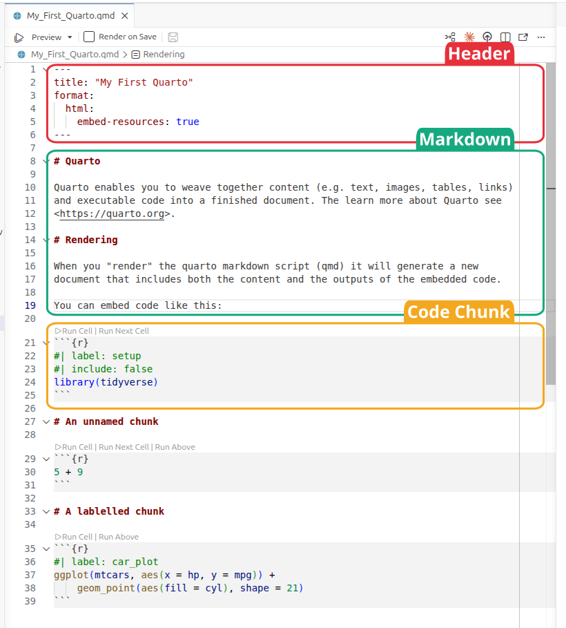

<!-- GENERATED by _MakeInstructorNotes.R from _instructor_prompt.md.
     Committed, but do not hand-edit below the BODY marker: the next run
     that sees a changed source page overwrites it. To change the prose,
     edit the prompt; to change the layout, edit this script. -->
<!-- instructor-notes: source=session8.qmd md5=d014a5159b899e3b40f656b6fd465226 commit=25471859b6eac7133160cbe89f84a78b0ffdef91 dirty=no model=opus effort=high -->

```{r}
#| label: instructor-setup
#| include: false
# width/cli.width are set project-wide in _quarto.yml and are restated
# here so that this one chunk is the whole story for a generated page -
# otherwise a later edit here silently drops them.
options(width = 80, cli.width = 80,
        tibble.print_min = 2, tibble.print_max = 2,
        # A 32-column tibble spends six lines listing the columns it
        # could not fit. One line saying how many is enough here - the
        # "1,904 x 32" header already gives the shape.
        tibble.max_extra_cols = 1)

# Base data frames have no equivalent of the tibble options, so they need
# a method. It MUST let tibbles through: they are data frames too, so S3
# dispatch would land them here, and head() would throw away the real
# row count that the tibble footer reports. kable/kableExtra/DT all
# return their own classes, so none of them come through this.
registerS3method("knit_print", "data.frame", function(x, ...) {
    if (inherits(x, "tbl_df")) return(knitr::normal_print(x))
    knitr::normal_print(utils::head(x, 2L))
}, envir = asNamespace("knitr"))
```

::: {.instructor-nav}
[Contents](instructor_index.html) &nbsp;·&nbsp; [1](instructor_session1.html) &nbsp;·&nbsp; [2](instructor_session2.html) &nbsp;·&nbsp; [3](instructor_session3.html) &nbsp;·&nbsp; [4](instructor_session4.html) &nbsp;·&nbsp; [5](instructor_session5.html) &nbsp;·&nbsp; [6](instructor_session6.html) &nbsp;·&nbsp; [7](instructor_session7.html) &nbsp;·&nbsp; **8** &nbsp;·&nbsp; [Student page](session8.html)
:::

<!-- BODY -->
::: {.callout-note .objectives title="Learning objectives"}
* Learn how to generate an html/pdf report using Quarto and Positron
* Write formatted text, tables, links and images using Markdown
* Embed executable R code in a document and control how its output appears
* Present tables and figures in a report using knitr, kableExtra, DT and patchwork
:::

---

# What is Quarto?

* Combines executable code, its output and text in one document
* Renders to HTML, PDF, Word, slides; R, Python, Julia, Observable JS
* Made by Posit -- full guide at <https://quarto.org/docs/guide/>

# Packages for this session

```{r}
#| label: packages
#| message: false
library(tidyverse)
library(knitr)
library(kableExtra)
library(DT)
library(patchwork)
```

* `knitr` is the engine that runs the chunks -- Quarto loads it for you; load it
  explicitly only to avoid typing `knitr::kable()`
* `kableExtra` -- table formatting on top of `kable`; `DT` -- interactive
  tables; `patchwork` -- combine ggplots

# Creating a Quarto document

* `File` --> `New File` --> `Quarto Document`
* Change the title, save as "My_First_Quarto.qmd" in `Bioinformatics_Workshop`
* Extension is `.qmd`

# The basic components of a Quarto document

- Header - metadata and instructions related to rendering the document
- Markdown sections - Text, images, links, tables, lists to be included in the
  report
- Code chunks - Code chunks to be executed and the output included in the
  report

::: {.showimg}


Show **the components of a Quarto document** here
:::

# Header

* [YAML](https://yaml.org/), fenced top and bottom by `---`
* Only `format` is required; everything else is metadata or render instructions

```         
---
title: "My First Quarto Document"
author: "Ashley Sawle"
format: html
date: "2026-08-21"
---
```

* Alternatives to `html`: `pdf`, `docx`, `revealjs` (slides)

# Markdown sections {#markdown-header}

* **Markdown** -- lightweight, platform independent markup; formatting is not
  visible until rendered
* Full syntax reference:
  [Markdown basics](https://quarto.org/docs/authoring/markdown-basics.html)

## Inline text formatting

* Surround the text with the symbol pair; any amount of text can sit between

`This is *italics*` or `This is _italics_` → This is *italics*

-   Double asterisks/underscores for **bold**:

    `This **is bold**` or `This __is bold__` → This **is bold**

-   Tilde (`~`) for subscript:

    `This is ~subscript~` → This is ~subscript~

-   Caret (`^`) for superscript:

    `This is ^superscript^` → This is ^superscript^

-   Double tilde (`~`) for strikethrough:

    `~~This is strikethrough~~` → ~~This is strikethrough~~

-   Backticks (`` ` ``) for "code" font:

    `` This is `code` `` → This is `code`

## Headings

* `#` at the start of the line -- one `#` is the top level (document title)
* Say the word: **octothorp**

```         
# Section
# Sub-section
## Sub-sub section
### Sub-sub-sub section
#### Sub-sub-sub-sub section
```

### Adding a table of contents

* This is a render instruction, so it goes in the header yaml

```         
format:
  html:
    toc: true
```

* Defaults to level 3 and a floating right-hand position

```         
format:
  html:
    toc: true
    toc-depth: 4
    toc-location: left
```

* **Gotcha** -- Quarto option names use hyphens, not underscores: `toc-depth`

### Tab sets

* Fenced div with class `.panel-tabset`; each sub-heading inside becomes a tab

````         
::: {.panel-tabset}

### Bold

Bold is achieved with double asterisks e.g. `**bold**` is rendered as **bold**.

### Italics

Italics is achieved with a single asterisk e.g. `*italics*` is rendered as *italics*.

### Strikethrough

Strikethrough is achieved with two tildes e.g. `~~strikethrough~~` is rendered as 
~~Strikethrough~~.

:::

### Next section

The tab set ends when the div is closed.
````

is rendered as:

:::: {.renderedblock}

::: {.panel-tabset}

#### Bold

Bold is achieved with double asterisks e.g. `**bold**` is rendered as
**bold**.

#### Italics

Italics is achieved with a single asterisk e.g. `*italics*` is rendered
as *italics*.

#### Strikethrough

Strikethrough is achieved with two tildes e.g. `~~strikethrough~~` is rendered
as ~~Strikethrough~~.

:::

#### Next section

The tab set ends when the div is closed.

::::

* Border/background here is styling for these notes only, not Quarto default

## Line breaks

* Consecutive lines are concatenated into one paragraph -- end the line with two
  spaces or a backslash to force a break

```         
This is the first line
There are no spaces after the end of the previous line
```

is rendered as:

::: {.renderedblock}
This is the first line There are no spaces after the end of the previous
line
:::

where as:

```         
This is the first line\
There are no spaces after the end of the previous line
```

is rendered as:

::: {.renderedblock}
This is the first line\
There are no spaces after the end of the previous line
:::

## Lists

### Unordered lists

* `*`, `-` or `+` -- all identical; nest by indenting 4 spaces

```         
* Cricket
* Rugby
* Football
    * English Premier League
    * La Liga
    * Serie A
* Basketball
* Volleyball
* Hockey
```

is rendered as:

::: {.renderedblock}
-   Cricket
-   Rugby
-   Football
    -   English Premier League
    -   La Liga
    -   Serie A
-   Basketball
-   Volleyball
-   Hockey
:::

### Ordered lists

* Number for numeric, `a` for letters, `i` for roman numerals; indent to nest

```         
1. Cat
2. Ferret
3. Dog
    a. Terriers
        i.  Jack Russell
        ii. Airedale
        iii. Yorkshire
        iv. West Highland
    b. Labradors
    c. Spaniels
4. Goldfish
```

is rendered as:

::: {.renderedblock}
1.  Cat
2.  Ferret
3.  Dog
    a.  Terriers
        i.  Jack Russell
        ii. Airedale
        iii. Yorkshire
        iv. West Highland
    b.  Labradors
    c.  Spaniels
4.  Goldfish
:::

* The actual numbers/letters don't matter -- order is worked out at render time

```         
1. Cat
1. Ferret
5. Dog
    a. Terriers
        i.  Jack Russell
        i. Airedale
        i. Yorkshire
        i. West Highland
    b. Labradors
    a. Spaniels
1. Goldfish
```

## Links

* Square brackets = text shown, round brackets = destination

```         
[This is the text](this_is_the_link)
```

### External links

`[session 6 document](session6.html)` → [session 6 document](session6.html)

`[The Quarto guide](https://quarto.org/docs/guide/)`
→ [The Quarto guide](https://quarto.org/docs/guide/)

### Internal links to sections

* Quarto auto-generates an id from the heading text -- usually no tag needed

`[link to header](#markdown-sections)`

* Custom id via a tag on the heading: `# Markdown sections {#markdown-header}`

`[link to header](#markdown-header)`

e.g. Follow [this link](#markdown-header) to get to the top of this section.

## Inserting images

* Same as a link but preceded by `!`; path can be relative or a URL

``

``

::: {.showimg}


Show **the cheetah image example** here
:::

* Size control via an attribute block -- percentage of document width or pixels

`{width=10%}`

`{width=150px}`

## Tables {#tables}

* Hand-written tables are rare -- most come from code chunks

```         
| Animal      | Park            |
| ----------- | --------------- |
| lion        | Kidepo Valley   |
| elephant    | Murchison Falls |
| crocodile   | Murchison Falls |
```

is rendered as:

::: {.renderedblock}
| Animal    | Park            |
|-----------|-----------------|
| lion      | Kidepo Valley   |
| elephant  | Murchison Falls |
| crocodile | Murchison Falls |
:::

* Colons in the separator row set alignment -- left, centre, right

```         
| Animal    | Park            |   Eats |
| :---      | :----:          |   ---: |
| lion      | Kidepo Valley   | meat   |
| elephant  | Murchison Falls | plants |
| crocodile | Murchison Falls | meat   |
```

This is rendered as:

::: {.renderedblock}
| Animal    |      Park       |   Eats |
|:----------|:---------------:|-------:|
| lion      |  Kidepo Valley  |   meat |
| elephant  | Murchison Falls | plants |
| crocodile | Murchison Falls |   meat |
:::

## Blockquotes

* `>` at the start of each line

```         
> "The R language is a free software environment for statistical
> computing and graphics supported by the R Foundation for Statistical
> Computing. The R language is widely used among statisticians and
> data miners for developing statistical software and data analysis."
> (Wikipedia)
```

is rendered as:

> "The R language is a free software environment for statistical computing and
> graphics supported by the R Foundation for Statistical Computing. The R
> language is widely used among statisticians and data miners for developing
> statistical software and data analysis." (Wikipedia)

## Code blocks

* Three backticks -- code **shown but not run**; contrast with a code chunk

````         
```
metabric |>
    group_by(ER_status, Cancer_type) |>
    summarise(ERBB2_mean = mean(ERBB2)) |>
    slice_max(ERBB2_mean, n = 1)
```
````

This will be rendered as:

::: {.renderedblock}
metabric |>
    group_by(ER_status, Cancer_type) |>
    summarise(ERBB2_mean = mean(ERBB2)) |>
    slice_max(ERBB2_mean, n = 1)
:::

# Code chunks

* Executed at render time -- this is what makes the report **reproducible**
* Three backticks plus `{r}`

```` markdown
```{{r}}
x <- 10
y <- 20
x + y
```
````

Generates the following in the output:

```{r}
#| label: demo_code_chunk
x <- 10
y <- 20
x + y
```

* By default code is echoed and output written beneath -- console output,
  tables, plots, warnings, errors

## Creating code chunks

* Insert icon on the toolbar, `Ctrl + Alt + I` / `Cmd + Option + I`, or type it
* Icons above the chunk: run this chunk, run all chunks above, chunk options

## Running code chunks

* Arrow icon, or `Ctrl + Shift + Enter` / `Cmd + Shift + Enter`

## Chunk options {#chunk_opts}

* **Hash-pipe** syntax `#|` at the top of the chunk, one YAML option per line

```` markdown
```{{r}}
#| echo: false
#| warning: false
x <- 10
y <- 20
x + y
```
````

-   `echo: false` - do not display the code in the rendered document, but do
    display the results of the code.
-   `include: false` - do not display either the code or the results in the
    document when it is rendered. The code will still run and so any changes it
    makes to the environment (new objects or changes to existing objects) will
    be available for subsequent code chunks.
-   `message: false` - do not display any messages that are generated by the
    code chunk in the rendered file.
-   `warning: false` - do not display warnings that are generated by the code
    chunk in the rendered file.
-   `eval: false` - do not run the code in the chunk, but display the code in
    the rendered document. 
-   `cache: true` - cache the results of the code chunk so that it does not
    need to be re-run every time the document is rendered. This can speed up
    rendering time for large code chunks or when the code takes a long time to
    run.
-   `fig-width` and `fig-height` - set the width and height of figures
    generated by the code chunk. 
-   `fig-cap` - set the caption for the figure generated by the code chunk.
    This will be displayed below the figure in the rendered document.

* **Gotcha** -- hyphens again: `fig-width`, never `fig_width` or `fig.width`
* Full list:
  [chunk options reference](https://quarto.org/docs/reference/cells/cells-knitr.html)

## Chunk label

```` markdown
```{{r}}
#| label: my-chunk
```
````

* Labelled chunks and headings appear in the outline menu at the top of the
  script panel -- navigation for long documents

## Document-wide execution options

* Set defaults once in the header yaml rather than on every chunk; individual
  chunks can still override

```         
---
title: "My First Quarto Document"
format: html
execute:
  echo: true
  warning: false
  message: false
---
```

* Good practice -- a `setup` chunk with `include: false` loading all packages

```` markdown
```{{r}}
#| label: setup
#| include: false
library(tidyverse)
library(patchwork)
library(knitr)
library(kableExtra)
library(DT)
```
````

* `include: false` hides both the code and the package startup messages

### A note on the working directory

* Working directory is the location of the `.qmd` file -- all paths relative to
  that, not to the project root
* Otherwise use the `here` package or set the path at the top

## Tabular output

* Default is plain console printing

```{r}
#| label: basicTable
smallTable <- mtcars |>
    rownames_to_column("car") |>
    select(car, mpg, cyl, wt) |>
    slice(1:5)
smallTable
```

### The `kable()` function

```{r}
#| label: kable
smallTable |>
    kable()
```

* `kable()` just writes the Markdown table syntax seen earlier

```{r}
#| label: kableFormatting
smallTable |>
    kable(digits = 2, align = "c")
```

* [Tables in Quarto](https://quarto.org/docs/authoring/tables.html)

### The `kableExtra` package

* `kbl()` replaces `kable()`, then pipe on formatting functions -- like adding
  layers to a ggplot

```{r}
#| label: kableExtraA
#| html-table-processing: none
smallTable |>
    kbl() |>
    kable_styling(bootstrap_options = c("striped", "hover")) |>
    column_spec(column = 1, bold = TRUE, border_right = TRUE)
```

* Also ships pre-defined styles

```{r}
#| label: kableExtraB
#| html-table-processing: none
smallTable |>
    kbl() |>
    kable_classic(full_width = F, html_font = "Cambria")
```

```` markdown
```{{r}}
#| label: kableExtraB
#| html-table-processing: none
smallTable |>
    kbl() |>
    kable_classic(full_width = F, html_font = "Cambria")
```
````

* **Gotcha** -- Quarto post-processes HTML tables and overrides `kableExtra`
  styling (e.g. `full_width = FALSE`); `html-table-processing: none` stops it
* Can be set once under `format: html:` in the header
* [kableExtra vignette](https://cran.r-project.org/web/packages/kableExtra/vignettes/awesome_table_in_html.html)

### The `DT` package

* Interactive -- sort, filter, search, paginate, export

```{r}
#| label: DTa
longTable  <- mtcars |>
    rownames_to_column("car") |>
    select(car, mpg, cyl, wt)
longTable |>
    datatable()
```

* Formatting via the `options` argument, a list; `dom` sets element layout,
  `buttons` the export buttons, `pageLength` rows per page

- `l` - length changing input control (how many rows to display)
- `f` - filtering input (search box)
- `t` - table
- `i` - table information summary (e.g. "Showing 1 to 10 of 57 entries")
- `p` - pagination control (next/previous buttons)
- `B` - buttons (export buttons)
- `r` - processing display element (loading indicator)

* Character order = display order; omitting `f` removes the search box
* Buttons need three things -- `extensions = "Buttons"`, `B` in `dom`, and the
  `buttons` option

```{r}
#| label: DTb
longTable |>
    datatable(
        extensions = "Buttons",
        options = list(
            dom = "Btip",
            buttons = c("csv", "excel"),
            pageLength = 5),
        colnames = c("Car", "Miles per gallon", "Cylinders", "Weight")
    )
```

* `DT` wraps the JavaScript library [DataTables](https://datatables.net/) --
  web searches often return JS docs
* Do not confuse `DT` with `data.table`
* **Warning** -- the whole table is embedded in the rendered file; large tables
  give huge documents

## Plots

```` markdown
```{{r}}
#| label: plot
mtcars |>
    ggplot(aes(x = mpg, y = wt)) +
    geom_point() +
    labs(title = "Scatter plot of weight vs miles per gallon",
         x = "Miles per gallon",
         y = "Weight") +
    theme_minimal()
```
````

is rendered as:

```{r}
#| label: plot
#| echo: false
mtcars |>
    ggplot(aes(x = mpg, y = wt)) +
    geom_point() +
    labs(title = "Scatter plot of weight vs miles per gallon",
         x = "Miles per gallon",
         y = "Weight") +
    theme_minimal()
```

* Default figure is 7 x 5 inches -- change with `fig-width`/`fig-height`
* `fig-cap` for the caption; option values are YAML, so a string is quoted

```` markdown
```{{r}}
#| label: plot2
#| fig-width: 5
#| fig-height: 3
#| fig-cap: "Scatter plot of weight vs miles per gallon"
mtcars |>
    ggplot(aes(x = mpg, y = wt)) +
    geom_point() +
    labs(x = "Miles per gallon",
         y = "Weight") +
    theme_minimal()
```
````

is rendered as:

```{r}
#| label: plot2
#| fig-width: 5
#| fig-height: 3
#| fig-cap: "Scatter plot of weight vs miles per gallon"
#| echo: false
mtcars |>
    ggplot(aes(x = mpg, y = wt)) +
    geom_point() +
    labs(x = "Miles per gallon",
         y = "Weight") +
    theme_minimal()
```

### The `patchwork` package

* Alternatives exist (`ggarrange`, `gridExtra`, `cowplot`) -- `patchwork` is the
  simplest
* Assign each plot to a variable rather than printing it, then combine

```{r}
#| label: patchworkA
#| fig-height: 5
#| fig-width: 10
p1 <- mtcars |>
    mutate(across(cyl, factor)) |>
    ggplot(aes(x = mpg, y = wt)) +
    geom_point(aes(colour = cyl)) +
    geom_text(label = "A", x = 22.5, y = 3.5, size = 50)
p2 <- mtcars |>
    mutate(across(cyl, factor)) |>
    ggplot(aes(x = gear, y = hp)) +
    geom_point(aes(colour = cyl)) +
    geom_text(label = "B", x = 4, y = 195, size = 50)
p1 + p2 
```

* `+` add, `/` stack vertically, `|` side by side
* `plot_layout()` for layout, e.g. `guides = "collect"` to merge identical
  legends; `plot_annotation()` for title/subtitle

```{r}
#| label: patchworkB
#| fig-height: 8
#| fig-width: 12
((p1 + p2) / (p2 + p1 + p2) | (p1 / p2 / p1)) +
    plot_layout(guides = "collect") +
    plot_annotation(title = "Patchwork example",
                    subtitle = "Combining plots with patchwork")
```

* Brackets define the groups -- `plot_layout()`/`plot_annotation()` apply to
  whichever grouping level they attach to, so wrap everything to hit the whole
  figure
* [patchwork docs](https://patchwork.data-imaginist.com/)

# Inline R code

* Single backticks starting with `r` -- pull a computed value into the text

```` markdown
```{{r}}
#| label: inline
six_cyl_mean_mpg <- mtcars |>
    filter(cyl == 6) |>
    summarise(mpg = mean(mpg)) |>
    pull(mpg)
```
The mean mpg of cars with 6 cylinders was **``r "r six_cyl_mean_mpg"``**.
````

Will be rendered as:

::: {.renderedblock}
```{r}
#| label: inline
six_cyl_mean_mpg <- mtcars |>
    filter(cyl == 6) |>
    summarise(mpg = mean(mpg)) |>
    pull(mpg)
```

The mean mpg of cars with 6 cylinders was **`r six_cyl_mean_mpg`**.
:::

# Rendering the document

* "Preview" from the three-dots menu at the top right of the script window
* Output appears in the Viewer; the `.html` lands beside the `.qmd`
* Other formats available; extensible to books and websites
* **Gotcha** -- a `<name>_files` folder holds the assets; move it with the HTML
  or the document breaks

```
format: 
  html:
    embed-resources: true
```

* Standalone single file -- but can get very large with many images

# Acknowledgements

This session was developed with reference to materials by 
[Alexia Cardona](https://github.com/ac812/reproducibility-training),
the 
[Data Carpentry project](https://datacarpentry.github.io/r-socialsci/instructor/06-rmarkdown.html)
and the [Quarto documentation](https://quarto.org/docs/guide/).

# Session details

* Good practice -- record R version and package versions at the end of the
  report

```{r}
#| label: sessionInfoDummy
#| eval: false
devtools::session_info()
``` 

```{r}
#| label: sessionInfo
#| echo: false
siList <- devtools::session_info()
siList$platform$date <- "2026-08-21"
siList
```
