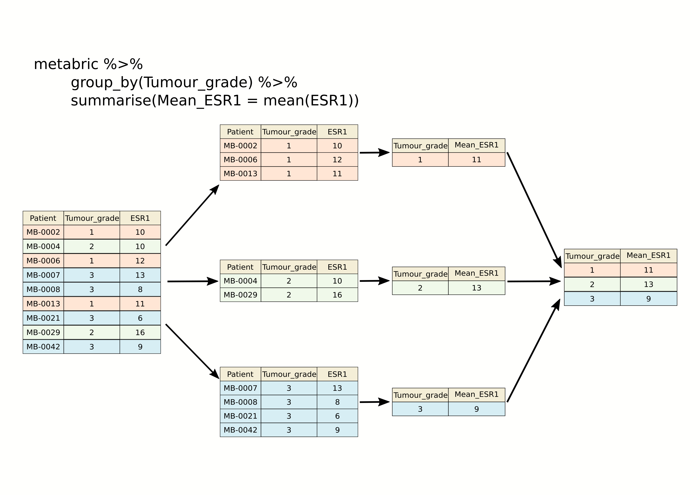
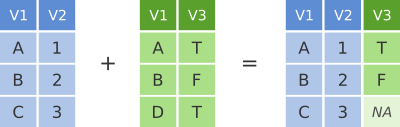
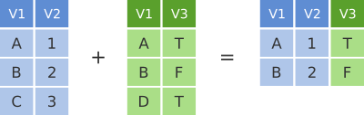
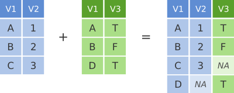

::: {.callout-note .objectives title="Learning objectives"}
* Use `group_by()` with `summarise()` to compute summary values for groups of
  observations
* Use `count()` to count the numbers of observations within categories
* Combine data from two tables based on a common identifier (`join`
  operations)
* Customize plots created using ggplot2 by changing labels, scales and
  colours
:::


# Grouping and combining data

In this session, we'll look at some more useful functions provided by the
**dplyr** package, the 'workhorse' in the tidyverse family for manipulating
tabular data. Continuing from the last session, we'll see how we can summarise
data for groups of observations within different categories. We'll also show
how dplyr allows us to combine data for the same observational unit, e.g.
person or date, that comes from different sources and is read into R in
different tables.

We'll also look at how to customize the plots we create using **ggplot2**, in
particular how we can add or change titles and labels, how we can adjust the
way the axes are displayed and how we can use a colour scheme of our choosing.

**dplyr** and **ggplot2** are core component packages within the tidyverse and
both get loaded as part of the tidyverse.

```{r}
library(tidyverse)
```

To demonstrate how these grouping and combining functions work and to illustrate
customization of plots, we'll again use the METABRIC data set.

```{r}
#| message: false
metabric <- read_csv("data/metabric_clinical_and_expression_data.csv")
metabric
```

# Grouping observations

## Summaries for groups

In the previous session we introduced the `summarise()` function for computing
a summary value for one or more variables from all rows in a table (data frame
or tibble). For example, we computed the mean expression of ESR1, the estrogen
receptor alpha gene, as follows.

```{r}
summarise(metabric, mean(ESR1))
```

While the `summarise()` function is useful on its own, it becomes really
powerful when applied to groups of observations within a dataset. For example,
we might be more interested in the mean ESR1 expression calculated separately
for ER positive and ER negative tumours. We could take each group in turn,
filter the data frame to contain only the rows for a given ER status, then apply
the `summarise()` function to compute the mean expression, but that would be
somewhat cumbersome. Even more so if we chose to do this for a categorical
variable with more than two states, e.g. for each of the integrative clusters.
Fortunately, the **`group_by()`** function and **.by** argument to summarise
allow this to be done in one simple step.

```{r}
metabric |>
    group_by(ER_status) |>
    summarise(mean(ESR1))
```

or

```{r}
metabric |>
    summarise(mean(ESR1), .by = ER_status)
```

The following schematic contains another example using a simplified subset of
the METABRIC tumour samples to show what's going on.




We get an additional column in our output for the categorical variable,
`ER_status`, and a row for each category.

When we group by only one column there is no difference between the two methods.

Incidentally, we should expect this result of ER-positive tumours having a
higher expression of ESR1 on average than ER-negative tumours. Simple summaries
like this are a good way of checking that what we think we know actually holds
true in the data we're looking at. Note that the expression values are on a
log~2~scale so ER-positive breast cancers express ESR1 at a level that is
approximately 20 times greater, on average, than that of ER-negative tumours.

```{r}
2 ^ (10.6 - 6.21)  # equivalent to (2 ^ 10.6) / (2 ^ 6.21)
```

We can group by more than one column. When we do this there are some
differences by between using **group_by** or **.by**.

Let's say we want to look at ERBB2 expression in ER positive and negative, but
further divided by the cancer type.

```{r}
metabric |>
    group_by(ER_status, Cancer_type) |>
    summarise(mean(ERBB2))
```

You can see that the tibble is still grouped by "ER\_status", this means any
subsequent operations will be carried out within the groupings based on
"ER\_status". Perhaps, after summarising, we want to find which group has the
maximum mean ERBB2 expression. We can use the dplyr function **slice_max()** to
get the top result, telling it which column to rank the rows by.

```{r}
metabric |>
    group_by(ER_status, Cancer_type) |>
    summarise(ERBB2_mean = mean(ERBB2)) |>
    slice_max(ERBB2_mean, n = 1)
```

This gives us the top value for ER positive and ER negative groups respectively.
Even though we asked for a single row, we got two, because `slice_max()` is
operating within the retained "ER\_status" grouping.

If we don't want the grouping to continue to be applied we need to use
**ungroup()**.

```{r}
metabric |>
    group_by(ER_status, Cancer_type) |>
    summarise(ERBB2_mean = mean(ERBB2)) |>
    ungroup() |>
    slice_max(ERBB2_mean, n = 1)
```

Now we get the single highest value across the whole table.

If instead we use **.by** to do the grouping, you will see that the grouping is
dropped after the summarise operation.

```{r}
metabric |>
    summarise(ERBB2_mean = mean(ERBB2), .by = c(ER_status, Cancer_type))
```

You should also notice, that the tibble returned by **group_by** was sorted
by our grouping columns, the tibble returned when using **.by** is not
sorted. In general, using **.by** is simpler as you don't have to worry about
doing the **ungroup()** afterwards.

Per-operation grouping is available in other dplyr verbs too, including
`slice_max()`, so we can do the whole thing without `group_by()` at all. Note
that `mutate()`, `filter()` and `summarise()` spell it **.by** with a dot, while
`slice_max()` and its relatives use plain **by** — the dot avoids any clash with
the columns you are naming in those functions.

```{r}
metabric |>
    summarise(ERBB2_mean = mean(ERBB2), .by = c(ER_status, Cancer_type)) |>
    slice_max(ERBB2_mean, n = 1, by = ER_status)
```

As we saw in the previous session, we can summarize multiple observations, e.g.
the mean expression for other genes of interest, with `summarise(across())`,
this time using the PAM50 classification to define the groups.

```{r}
metabric |>
    summarise(across(c(ESR1, PGR, ERBB2), mean), .by = PAM50)
```

We can also refine our groups by using more than one categorical variable. Let's
subdivide the PAM50 groups by HER2 status to illustrate this.

```{r}
metabric |>
    summarise(across(c(ESR1, PGR, ERBB2), mean), .by = c(PAM50, HER2_status))
```

It can be quite useful to know how many observations are within each group. We
can use a special function, **`n()`**, that counts the number of rows rather
than computing a summary value from one of the columns.

```{r}
metabric |>
    summarise(N = n(), ESR1_mean = mean(ESR1), .by = c(PAM50, HER2_status))
```

## Counts

Counting observations within groups is such a common operation that dplyr
provides a **`count()`** function to do just that. So we could count the number
of patient samples in each of the PAM50 classes as follows.

```{r}
count(metabric, PAM50)
```

This is much like the `table()` function we've used several times already to
take a quick look at what values are contained in one of the columns in a data
frame. They return different data structures however, with `count()` always
returning a data frame (or tibble) that can then be passed to subsequent steps
in a 'piped' workflow.

If we wanted to subdivide our categories by HER2 status, we can add this as an
additional categorical variable just as we did with the previous `group_by()`
examples.

```{r}
count(metabric, PAM50, HER2_status)
```

The count column is named 'n' by default but you can change this.

```{r}
count(metabric, PAM50, HER2_status, name = "Samples")
```

`count()` is equivalent to grouping observations calling `summarize()` using
the special `n()` function to count the number of rows. So the above statement
could have been written in a more long-winded way as follows.

```{r}
#| eval: false
metabric |>
    summarize(Samples = n(), .by = c(PAM50, HER2_status))
```

Summarizing with `n()` is useful when showing the number of observations in a
group alongside a summary value, as we did earlier looking at the mean ESR1
expression within specified groups; it allows you to see if you're drawing
conclusions from only a few data points.

## Missing values

Many summarization functions return `NA` if any of the values are missing, i.e.
the column contains `NA` values. As an example, we'll compute the average size
of ER-negative and ER-positive tumours.

```{r}
metabric |>
    summarize(N = n(),
              `Average tumour size` = mean(Tumour_size),
              .by = ER_status)
```

The `mean()` function, along with many similar summarization functions, has an
`na.rm` argument that can be set to `TRUE` to exclude those missing values from
the calculation.

```{r}
metabric |>
    summarize(N = n(),
              `Average tumour size` = mean(Tumour_size, na.rm = TRUE),
              .by = ER_status)
```

An alternative would be to filter out the observations with missing values but
then the number of samples in each ER status group would take on a different
meaning, which may or may not be what we actually want.

```{r}
metabric |>
    filter(!is.na(Tumour_size)) |>
    summarize(N = n(),
              `Average tumour size` = mean(Tumour_size),
              .by = ER_status)
```

## Counts and proportions

The `sum()` and `mean()` summarization functions are often used with logical
values. It might seem surprising to compute a summary for a logical variable but
but this turns out to be quite a useful thing to do, for counting the number of
`TRUE` values or obtaining the proportion of values that are `TRUE`.

Following on from the previous example we could add a column to our summary of
average tumour size for ER-positive and ER-negative patients that contains the
number of missing values.

```{r}
metabric |>
    summarize(N = n(),
              Missing = sum(is.na(Tumour_size)),
              `Average tumour size` = mean(Tumour_size, na.rm = TRUE),
              .by = ER_status)
```

Why does this work? Well, the `is.na()` function takes a vector and sees which
values are `NA`, returning a logical vector of `TRUE` where the value was `NA`
and `FALSE` if not.

```{r}
test_vector <- c(1, 3, 2, NA, 6, 5, NA, 10)
is.na(test_vector)
```

The `sum()` function treats the logical vector as a set of `0`s and `1`s where
`FALSE` is `0` and `TRUE` is `1`. In effect `sum()` counts the number of `TRUE`
values.

```{r}
sum(is.na(test_vector))
```

Similarly, `mean()` will compute the proportion of the values that are `TRUE`.

```{r}
mean(is.na(test_vector))
```

So let's calculate the number and proportion of samples that do not have a
recorded tumour size in each of the ER-negative and ER-positive groups.

```{r}
metabric |>
    summarize(N = n(),
              `Missing tumour size` = sum(is.na(Tumour_size)),
              `Proportion missing` = mean(is.na(Tumour_size)),
              .by = ER_status)
```

We can use `sum()` and `mean()` for any condition that returns a logical vector.
We could, for example, find the number and proportion of patients that survived
longer than 10 years (120 months) in each of the ER-negative and ER-positive
groups.

```{r}
metabric |>
    filter(Survival_status == "DECEASED") |>
    summarise(N = n(),
              N_long_survival = sum(Survival_time > 120),
              Proportion_long_survival = mean(Survival_time > 120),
              .by = ER_status)
```

## Selecting or counting distinct things

There are occasions when we want to count the number of distinct values in a
variable or a combination of variables. Here we introduce another set of data
from the METABRIC study which contains details of the mutations detected by
targeted sequencing of a panel of 173 genes. We'll read this data into R now as
this provides a good example of having multiple observations in different rows
for a single observational unit, in this case several mutations detected in
each tumour sample.


```{r}
#| message: false
mutations <- read_csv("data/metabric_mutations.csv")

select(mutations,
       Patient_ID,
       Chromosome,
       Position = Start_Position,
       Ref = Reference_Allele,
       Alt = Tumor_Seq_Allele1,
       Type = Variant_Type,
       Gene)
```

We can see from just these few rows that each patient sample has multiple
mutations and sometimes there are more than one mutation in the same gene within
a sample, as can be seen in the first two rows at the top of the table above.

If we want to count the number of patients in which mutations were detected we
could select the distinct set of patient identifiers using the **`distinct()`**
function and then count the number of rows left. Distinct reduces the table to
only contain one row for each value of the column (or combination of columns)
provided:

```{r}
mutations |>
    distinct(Patient_ID) |>
    nrow()
```

However, if we want to count the number of mutations per a patient we can
use the dplyr function **`count()`**:

```{r}
count(mutations, Patient_ID)
```

Similarly if wanted to count the number of mutations detected in each gene:

```{r}
count(mutations, Gene)
```

What if we want to count the number of patients in which a mutation is seen for
each gene. First, we need to use **`distinct()`** to reduce the table to just
one entry per gene for each patient (one patient may have multiple mutations in
a single gene) and the use **`count()`** to count the number of times we see
each each.

```{r}
mutations |>
    distinct(Patient_ID, Gene) |>
    count(Gene)
```

The genes that differ in these two tables are those that have more than one
mutation within a patient tumour sample.

We can also use count on combinations of columns, for example we may want to
know how many mutations each patient has on each chromosome. To this we simply
provide **`count()`** with both columns:

```{r}
mutations |>
    count(Patient_ID, Chromosome)
```

# Joining data

In many real life situations, data are spread across multiple tables or
spreadsheets. Usually this occurs because different types of information about a
subject, e.g. a patient, are collected from different sources. It may be
desirable for some analyses to combine data from two or more tables into a
single data frame based on a common column, for example, an attribute that
uniquely identifies the subject such as a patient identifier.

dplyr provides a set of join functions for combining two data frames based on
matches within specified columns. These operations are very similar to carrying
out join operations between tables in a relational database using SQL.

## `left_join`

To illustrate join operations we’ll first consider the most common type, a “left
join”. In the schematic below the two data frames share a common column, V1. We
can combine the two data frames into a single data frame by matching rows in the
first data frame with those in the second data frame that share the same value
of variable V1.



`left_join()` returns all rows from the first data frame regardless of whether
there is a match in the second data frame. Rows with no match are included in
the resulting data frame but have `NA` values in the additional columns coming
from the second data frame.

Here’s an example using two small tables about animals found in Ugandan
national parks (we'll look at a real example shortly). One table records the
park in which each animal was recorded and the other records what each animal
eats.

These tables are stored as `.rds` files. RDS is R's own file format for saving a
single R object, such as a data frame, exactly as it is. We read one in using
readr's **`read_rds()`** function.

```{r}
animals <- read_rds("data/animals.rds")
animal_diets <- read_rds("data/animal_diets.rds")
```

The `animal` column identifies each of the animals and is used for matching
rows from the two tables. We specify the column (or columns) to match on using
the **`join_by()`** helper, writing the column names without quotes just as we
do elsewhere in the tidyverse.

```{r}
animals
animal_diets
left_join(animals, animal_diets, by = join_by(animal))
```

We have joined the two tables based on the common `animal` column. Because this
is a left join, only observations for animals in the 'left' table (`animals`)
are included with information brought in from the 'right' table
(`animal_diets`) where such exists. There is no entry in `animal_diets` for the
lion so an `NA` value is inserted into the `eats` column that gets added in the
combined data frame. The hippo is only included in the `animal_diets` data frame
so doesn't make it into the final output as this is based on those animals in
the 'left' table.

Note that the `NA` for the lion tells us that the diet was not recorded in this
table, not that lions don't eat. Gaps like this are very common when combining
data collected from different sources.

`right_join()` is similar but returns all rows from the second data frame, i.e.
the 'right' data frame, that have a match with rows in the first data frame.

```{r}
right_join(animals, animal_diets, by = join_by(animal))
```

`right_join()` is used very infrequently compared with `left_join()`.

## `inner_join`

Another joining operation is the "inner join" in which only observations that
are common to both data frames are included.



```{r}
inner_join(animals, animal_diets, by = join_by(animal))
```

In this case when considering observations identified by `animal`, only the
elephant and the crocodile are contained in both the `animals` and
`animal_diets` tables, so only these make it into the combined table.

## `full_join`

We've seen how missing rows from one table can be retained in the joined data
frame using `left_join` or `right_join` but sometimes data for a given subject
may be missing from either of the tables and we still want that subject to
appear in the combined table. A `full_join` will return all rows and all columns
from the two tables and where there are no matching values, `NA` values are used
to fill in the missing values.



```{r}
full_join(animals, animal_diets, by = join_by(animal))
```

Now, with `full_join()`, we have rows for both the lion and the hippo even
though they are only in one or other of the tables being joined.

## Joining on columns with different headers

It isn't uncommon for the columns used for joining two tables to have different
names in each table. Of course we could rename one of the two columns, e.g.
using the dplyr `rename()` function, but the dplyr join functions allow you to
match using differently-named columns as illustrated using another version of
the `animal_diets` data frame in which the first column is called `species`.

```{r}
animal_diets2 <- read_rds("data/animal_diets2.rds")
animal_diets2
left_join(animals, animal_diets2, by = join_by(animal == species))
```

Here `join_by(animal == species)` says "match the `animal` column in the left
table against the `species` column in the right table". The name for the column
used for joining in the combined table is the one given in the first table, i.e.
the 'left' table, so `animal` rather than `species` in this case.

## Multiple matches in join operations

You may be wondering what happens if there are multiple rows in one of both of
the two tables for the thing that is being joined, for example what would happen
if our second table had two entries for the things an elephant eats.

Let's add an extra food for the elephant and see what happens when we join the
two tables. We'll use the `bind_rows()` function to add a row to the
`animal_diets` tibble.

```{r}
extra_food <- tibble(animal = "elephant", eats = "fruit")
animal_diets3 <- bind_rows(animal_diets, extra_food)
animal_diets3
left_join(animals, animal_diets3, by = join_by(animal))
```

We get both entries from the second table added to the first table.

Let's add an entry for the elephant being recorded in a second park and see what
happens then when we combine the two tables, each with two entries for the
elephant.

```{r}
extra_park <- tibble(animal = "elephant", park = "Kibale")
animals3 <- bind_rows(animals, extra_park)
animals3
left_join(animals3, animal_diets3, by = join_by(animal))
```

The resulting table includes all combinations of park and food for the elephant.

Notice that dplyr gave us a warning about an "unexpected many-to-many
relationship". Because the elephant now appears twice in *both* tables, each of
its two parks is paired with each of its two foods, giving four rows from what
were only two entries on each side. Most of the time this is a sign that
something is wrong with your data, e.g. duplicated rows you weren't expecting,
which is why dplyr draws your attention to it. If it really is what you intended,
you can say so explicitly and the warning goes away.

```{r}
left_join(animals3,
          animal_diets3,
          by = join_by(animal),
          relationship = "many-to-many")
```

## Joining by matching on multiple columns

Sometimes the observations being combined are identified by multiple columns,
for example, a genus and a species. We can list several columns inside
`join_by()` to be used in the join operation.

Here are two more tables in which the animals are identified by their scientific
name, which is made up of a genus and a species. These also include an extra
animal, the leopard. We can join them based on both genus and species.

```{r}
animal_species <- read_rds("data/animal_species.rds")
species_diets <- read_rds("data/species_diets.rds")

animal_species
species_diets

full_join(animal_species, species_diets, by = join_by(genus, species))
```

Both columns are needed here. The lion and the leopard share the genus
`Panthera`, so joining on `genus` alone would incorrectly match the lion to the
leopard's diet. It is only the genus and species together that identify an
animal.

## Clashing column names

Occasionally we may find that there are duplicated columns in the two tables we
want to join, columns that aren't those used for joining. These variables may
even contain different data but happen to have the same name. In such cases
dplyr joins add a suffix to each column in the combined table.

For example, here are two more versions of our tables, each of which came from a
different wildlife survey and so each records the year in which its own
observations were made in a column called `survey_year`.

```{r}
animal_survey <- read_rds("data/animal_survey.rds")
diet_survey <- read_rds("data/diet_survey.rds")

animal_survey
diet_survey

left_join(animal_survey, diet_survey, by = join_by(animal))
```

It is advisable to rename or remove the duplicated columns that aren't used for
joining.

## A real example: joining the METABRIC clinical and mRNA expression data

Let's move on to a real example of joining data from two different tables that
we used in putting together the combined METABRIC clinical and expression data
set.

We first read the clinical data into R and then just select a small number of
columns to make it easier to see what is going on when combining the data.

```{r}
#| message: false
clinical_data <- read_csv("data/metabric_clinical_data.csv")
clinical_data <- select(clinical_data, Patient_ID, ER_status, PAM50)
clinical_data
```

We then read in the mRNA expression data that was downloaded separately from
[cBioPortal](https://www.cbioportal.org/study/summary?id=brca_metabric).


```{r loadmRNA}
#| message: false
mrna_expression_data <- read_tsv("data/metabric_mrna_expression.txt")
mrna_expression_data
```

Now we have both sets of data loaded into R as data frames, we can combine them
into a single data frame using an `inner_join()`. Our resulting table will only
contain entries for the patients for which expression data are available.

```{r}
combined_data <- inner_join(clinical_data,
                            mrna_expression_data,
                            by = join_by(Patient_ID == SAMPLE_ID))
combined_data
```

Having combined the data, we can carry out exploratory data analysis using
elements from both data sets.

```{r box_plot_1}
combined_data |>
    filter(!is.na(PAM50), !is.na(ESR1)) |>
    ggplot(mapping = aes(x = PAM50, y = ESR1, colour = PAM50)) +
    geom_boxplot(show.legend = FALSE)
```


# Customizing plots with ggplot2

Finally, we'll turn our attention back to visualization using ggplot2 and how
we can customize our plots by adding or changing titles and labels, changing the
scales used on the x and y axes, and choosing colours.

## Titles and labels

Adding titles and subtitles to a plot and changing the x- and y-axis labels is
very straightforward using the `labs()` function.

```{r scatter_plot_1}
ggplot(metabric, mapping = aes(x = GATA3, y = ESR1, colour = ER_status)) +
    geom_point(size = 0.6, alpha = 0.5) +
    geom_smooth(method = "lm") +
    labs(title = "mRNA expression in the METABRIC breast cancer data set",
         subtitle = "Expression measured with Illumina bead arrays",
         x = "log2 GATA3 expression",
         y = "log2 ESR1 expression",
         colour = "ER status")
```

The labels are another component of the plot object that we've constructed,
along with aesthetic mappings and layers (geoms). The plot object is a list and
contains various elements including those mappings and layers and one element
named `labels`.

`labs()` is a simple function for creating a list of labels you want to specify
as name-value pairs as in the above example. You can name any aesthetic (in this
case x and y) to override the default values (the column names) and you can add a
title, subtitle and caption if you wish. In addition to changing the x- and
y-axis labels, we also removed the underscore from the legend title by setting
the label for the colour aesthetic.

## Scales

Take a look at the x and y scales in the above plot. ggplot2 has chosen the x
and y scales and where to put breaks and ticks.

The x and y variables (`GATA3` and `ESR1`) are continuous so ggplot2 adds a
continuous scale for each. `ER_status` is a discrete variable in this case so
ggplot2 adds a discrete scale for colour.

In addition to *geom_XXXX* layers for different geometries, we can also add use
scale layers to modify the scales to our liking. The general format for the
scale names is:

```
scale_<NAME_OF_AESTHETIC>_<NAME_OF_SCALE>
```

Look at the help page for `scale_y_continuous` to see what we can change about
the y-axis scale.

First we'll change the breaks, i.e. where ggplot2 puts ticks and numeric
labels, on the y axis.

```{r scatter_plot_2}
ggplot(data = metabric,
       mapping = aes(x = GATA3, y = ESR1, colour = ER_status)) +
    geom_point(size = 0.6, alpha = 0.5) +
    geom_smooth(method = "lm") +
    scale_y_continuous(breaks = seq(5, 15, by = 2.5))
```

`seq()` is a useful function for generating regular sequences of numbers. In
this case we wanted numbers from 5 to 15 going up in steps of 2.5.

```{r}
seq(5, 15, by = 2.5)
```

We could do the same thing for the x axis using `scale_x_continuous()`.

We can also adjust the extents of the x or y axis.

```{r scatter_plot_3}
ggplot(data = metabric,
       mapping = aes(x = GATA3, y = ESR1, colour = ER_status)) +
    geom_point(size = 0.6, alpha = 0.5) +
    geom_smooth(method = "lm") +
    scale_y_continuous(breaks = seq(5, 15, by = 2.5), limits = c(4, 12))
```

Here, just for demonstration purposes, we set the upper limit to be less than
the largest values of ESR1 expression and ggplot2 warned us that some rows have
been removed from the plot.

Another way to alter the way the plot looks is to define a **`theme()`**. The
theme controls the way in which non-data components are displayed. You can
specify your own themes, e.g. to remove the grid lines you would do:

```{r scatter_plot_7a}
ggplot(data = metabric,
       mapping = aes(x = GATA3, y = ESR1, colour = ER_status)) +
    geom_point(size = 0.6, alpha = 0.5) +
    theme(panel.grid = element_blank())
```

We wont cover themes in any more detail in this course, but you can use them to control pretty much any aspect of the plot. On the other hand, there are also
a number of predefined themes (and more available in packages such as
*ggtheme*). For example the "minimal" theme:

```{r scatter_plot_7}
ggplot(data = metabric,
       mapping = aes(x = GATA3, y = ESR1, colour = ER_status)) +
    geom_point(size = 0.6, alpha = 0.5) +
    theme_minimal()
```

## Colours

The colour aesthetic is used with a categorical variable, `ER_status`, in the
scatter plots we've been customizing. The default colour scale used by ggplot2
for categorical variables is `scale_colour_discrete`. We can manually set the
colours we wish to use using `scale_colour_manual` instead.

```{r scatter_plot_10}
ggplot(data = metabric,
       mapping = aes(x = GATA3, y = ESR1, colour = ER_status)) +
    geom_point(size = 0.6, alpha = 0.5) +
    geom_smooth(method = "lm") +
    scale_colour_manual(values = c("dodgerblue2", "firebrick2"))
```

If we wanted to specify that "dodgerblue2" should be the colour for "Positive"
and "firebrick2" for "Negative", we need to add names to the values vector:

```{r scatter_plot_10a}
ggplot(data = metabric,
       mapping = aes(x = GATA3, y = ESR1, colour = ER_status)) +
    geom_point(size = 0.6, alpha = 0.5) +
    geom_smooth(method = "lm") +
    scale_colour_manual(values = c(Positive = "dodgerblue2",
                                   Negative = "firebrick2"))
```

Setting colours manually is ok when we only have two or three categories but
when we have a larger number it would be handy to be able to choose from a
selection of carefully-constructed colour palettes. Helpfully, ggplot2 provides
access to the [ColorBrewer](https://colorbrewer2.org) palettes through the
functions `scale_colour_brewer()` and `scale_fill_brewer()`.

```{r scatter_plot_11}
ggplot(data = metabric,
       mapping = aes(x = GATA3, y = ESR1, colour = `3-gene_classifier`)) +
    geom_point(size = 0.6, alpha = 0.5, na.rm = TRUE) +
    scale_colour_brewer(palette = "Set1")
```

Look at the help page for `scale_colour_brewer` to see what other colour
palettes are available and visit the [ColorBrewer](https://colorbrewer2.org)
website to see what these look like.

We can also set other attributes of the scale at the same time. For example,
we could change the names (labels) of the categories. Just as with `values`, it
is much safer to name the `labels` as well. If you supply them as a plain
unnamed vector they are matched up in the order the categories appear in the
data, which is not necessarily the order you wrote them in, and you can end up
with a legend that is mislabelled.

```{r scatter_plot_12}
ggplot(data = metabric,
       mapping = aes(x = GATA3, y = ESR1, colour = ER_status)) +
    geom_point(size = 0.6, alpha = 0.5) +
    geom_smooth(method = "lm") +
    scale_colour_manual(values = c(Positive = "dodgerblue2",
                                   Negative = "firebrick2"),
                        labels = c(Positive = "ER-positive",
                                   Negative = "ER-negative"))
```

We have applied our own set of mappings from levels in the data to aesthetic
values.

For continuous variables we may wish to be able to change the colours used in the
colour gradient. To demonstrate we'll use the Nottingham prognostic index
(NPI) values to colour points in the scatter plot of ESR1 vs GATA3
expression on a continuous scale.

```{r scatter_plot_123}
ggplot(data = metabric,
       mapping = aes(x = GATA3,
                     y = ESR1,
                     colour = Nottingham_prognostic_index)) +
    geom_point(size = 0.6, alpha = 0.5)
```

ggplot2 by default uses this black to blue continuous scale.  Higher NPI
scores correspond to worse prognosis and lower chance of 5 year survival. We'll
emphasize those points on the scatter plot by adjusting our colour scale to run
from white to red.

```{r scatter_plot_14}
metabric |>
    ggplot(mapping = aes(x = GATA3,
                         y = ESR1,
                         colour = Nottingham_prognostic_index)) +
    geom_point(size = 0.75) +
    scale_colour_gradient(low = "white", high = "red")
```

In some cases it might make sense to specify two colour gradients either side
of a mid-point.

```{r scatter_plot_15}
metabric |>
    ggplot(mapping = aes(x = GATA3,
                         y = ESR1,
                         colour = Nottingham_prognostic_index)) +
    geom_point(size = 0.75) +
    scale_colour_gradient2(low = "dodgerblue1",
                           mid = "grey90",
                           high = "firebrick1",
                           midpoint = 4.5)
```

# Summary

In this session we have covered the following:

* Computing summary values for groups of observations
* Counting the numbers of observations within categories
* Combining data from two tables through join operations
* Customizing plots created with ggplot2 by changing labels, scales and colours


# Exercises

:::: exercise
1. Compute the average survival time for the ER-negative and ER-positive groups.
Note that such a comparison only makes sense for those patients that are
deceased so apply the appropriate filter first. Add a column for the number of
patients in each group. You can use "metabric_clinical_data.csv" file.

::: {.callout-note .answer collapse="true" title="Answer"}
```{r ex_1}
#| purl: false
#| message: false
#| warning: false
library(tidyverse)
metabric <- read_csv("data/metabric_clinical_data.csv")
metabric |>
    filter(Survival_status == "DECEASED") |>
    group_by(ER_status) |>
    summarize(`Average survival time` = mean(Survival_time), N = n())
```
:::

::::


:::: exercise
2. Compute the average tumour size, number of positive lymph nodes and
Nottingham prognostic index within ER-negative and ER-positive patients.

::: {.callout-note .answer collapse="true" title="Answer"}
```{r ex_2}
#| purl: false
#| message: false
#| warning: false
library(tidyverse)
metabric <- read_csv("data/metabric_clinical_data.csv")
metabric |>
    group_by(ER_status) |>
    summarize(across(c(Tumour_size,
                       Lymph_nodes_examined_positive,
                       Nottingham_prognostic_index),
                     mean, na.rm = TRUE))
```
:::

::::


:::: exercise
3. Count the numbers of mutations for each gene and display the top 10 most
frequently mutated genes using metabric_mutations.csv data.

::: {.callout-note .answer collapse="true" title="Answer"}
```{r ex_3}
#| purl: false
#| message: false
#| warning: false
mutations <- read_csv("data/metabric_mutations.csv")
mutations |>
    count(Gene) |>
    arrange(desc(n)) |>
    head(10)
```
:::

::::


:::: exercise
4. In breast cancers, PIK3CA and TP53 are the most commonly mutated genes with
mutations occurring in specific regions of the gene. Find out which codons of
PIK3CA are most commonly mutated.

::: {.callout-note .answer collapse="true" title="Answer"}
```{r ex_4}
#| purl: false
#| message: false
#| warning: false
mutations |>
    filter(Gene == "PIK3CA") |>
    count(Codon) |>
    arrange(desc(n))
```
:::
::::


:::: exercise
5. Use boxplots to illustrate the distribution of diagnosis age for 3-gene
classification groups of patients. Remove any patients who are unclassified. The
boxplots should be coloured according to the group.

::: {.callout-note .answer collapse="true" title="Answer"}
```{r}
metabric |>
    filter(!is.na(`3-gene_classifier`)) |>
    ggplot(mapping = aes(x = `3-gene_classifier`,
                         y = Age_at_diagnosis,
                         colour = `3-gene_classifier`)) +
    geom_boxplot() +
    scale_colour_discrete(name = "3 gene classifier")
```
:::
::::


:::: exercise
6. Compare the prevalence of TP53 mutations across the Integrative Cluster
breast cancer subtypes.

Figure 5a from the METABRIC 2016 paper compares the percentage of samples that
have non-silent mutations for various genes within each of the Integrative
Clusters. In this exercise we'll reproduce a version of one of those bar charts
for the TP53 gene.

We need a bit of setup first. The METABRIC cohort contains 2509 patients but not
all tumour samples were sequenced, so we read the case list of sequenced samples
and add a column indicating this. We also convert `Integrative_cluster` into a
factor so that the clusters appear in the correct order rather than
alphabetically.

```{r}
#| message: false
#| warning: false
metabric <- read_csv("data/metabric_clinical_data.csv")
mutations <- read_csv("data/metabric_mutations.csv")

metabric <- metabric |>
    mutate(Integrative_cluster = factor(Integrative_cluster,
                                        levels = c("1", "2", "3", "4ER-",
                                                   "4ER+", "5", "6", "7",
                                                   "8", "9", "10")))

cases_sequenced <- read_tsv("data/cases_nat_comm_2016.txt",
                            col_names = "Patient_ID")
metabric <- metabric |>
    mutate(Sequenced = Patient_ID %in% cases_sequenced$Patient_ID)
count(metabric, Sequenced)
```

    a. Create a data frame containing the number of non-silent TP53 mutations in
    each patient sample, with two columns, `Patient_ID` and
    `TP53_mutation_count`. Join this to the `metabric` data frame.
    b. Create a new column `Has_TP53_mutation` containing `TRUE` or `FALSE`.
    *Hint: use the `is.na()` function.*
    c. Compute the percentage of patient samples within each Integrative Cluster
    that have a TP53 mutation, excluding samples that were not sequenced and
    those not classified into one of the clusters.
    d. Plot these percentages as a bar chart using `geom_col()`. Look at the help
    pages for `geom_bar` and `geom_col` to see why we want the latter here. Then
    add a title, tidy up the axis labels, show the full 0-100% range with breaks
    every 20%, remove the gap between the bars and the axis, apply the Viridis
    colour scheme (`scale_fill_viridis_d`), and use `theme_bw()` with the
    vertical grid lines removed.

::: {.callout-note .answer collapse="true" title="Answer"}

Exercise 6a: count the non-silent TP53 mutations per patient and join them on.

```{r}
tp53_mutation_counts <- mutations |>
    filter(Gene == "TP53", Variant_Classification != "Silent") |>
    count(Patient_ID, name = "TP53_mutation_count")

metabric <- left_join(metabric, tp53_mutation_counts, by = join_by(Patient_ID))
```

Exercise 6b: patients with no entry in the count column have no non-silent TP53
mutation.

```{r}
metabric <- metabric |>
    mutate(Has_TP53_mutation = !is.na(TP53_mutation_count))
```

Exercise 6c: taking the mean of a logical variable gives the proportion that are
`TRUE`.

```{r}
tp53_percentages <- metabric |>
    filter(Sequenced) |>
    filter(!is.na(Integrative_cluster)) |>
    summarise(Percentage_TP53_mutation = 100 * mean(Has_TP53_mutation),
              .by = Integrative_cluster)
tp53_percentages
```

Exercise 6d: the basic bar chart.

```{r}
ggplot(data = tp53_percentages) +
    geom_col(mapping = aes(x = Integrative_cluster,
                           y = Percentage_TP53_mutation))
```

And with the customizations applied.

```{r}
ggplot(data = tp53_percentages) +
    geom_col(mapping = aes(x = Integrative_cluster,
                           y = Percentage_TP53_mutation,
                           fill = Integrative_cluster),
             show.legend = FALSE) +
    labs(title = "Prevalence of TP53 mutations across Integrative Clusters",
         x = "Integrative Cluster",
         y = "% samples") +
    scale_y_continuous(breaks = c(0, 20, 40, 60, 80, 100),
                       expand = expansion(mult = 0),
                       limits = c(0, 100)) +
    scale_fill_viridis_d() +
    theme_bw() +
    theme(panel.grid.major.x = element_blank())
```

Compare this with figure 5a from the METABRIC mutation paper. Do the bars look
to be in roughly the correct proportions? Note that only 9 of the integrative
clusters are shown in figure 5a.

:::
::::


:::: exercise
7. Compute the tumour suppressor gene (TSG) score for each gene.

The TSG score is the proportion of inactivating mutations for each gene out of
the total number of mutations for that gene. Inactivating mutations are nonsense
SNVs, frameshift substitutions and variants that affect splice sites.

Compute the TSG score for each gene and find the top 10 tumour suppressor genes,
i.e. those with the highest TSG scores.

::: {.callout-tip .hint collapse="true" title="Hint"}
Use `%in%` to determine whether a mutation is an inactivating mutation.
:::

::: {.callout-note .answer collapse="true" title="Answer"}
```{r}
inactivating_mutation_types <- c("Nonsense_Mutation",
                                 "Frame_Shift_Del",
                                 "Frame_Shift_Ins",
                                 "Splice_Region",
                                 "Splice_Site")

tsg_scores <- mutations |>
    mutate(Inactivating =
               Variant_Classification %in% inactivating_mutation_types) |>
    summarise(TSG_score = mean(Inactivating), .by = Gene)

tsg_scores |>
    arrange(desc(TSG_score)) |>
    head(10)
```
:::
::::

